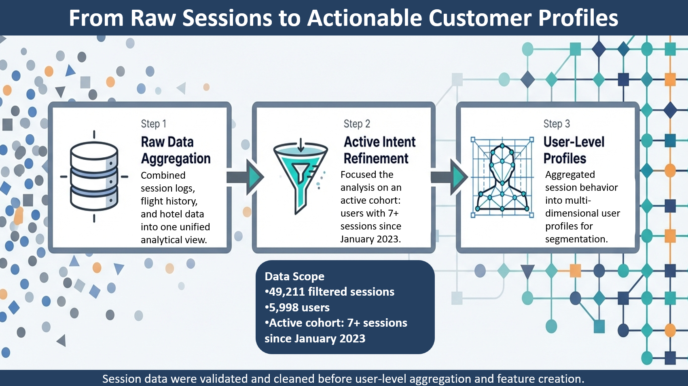
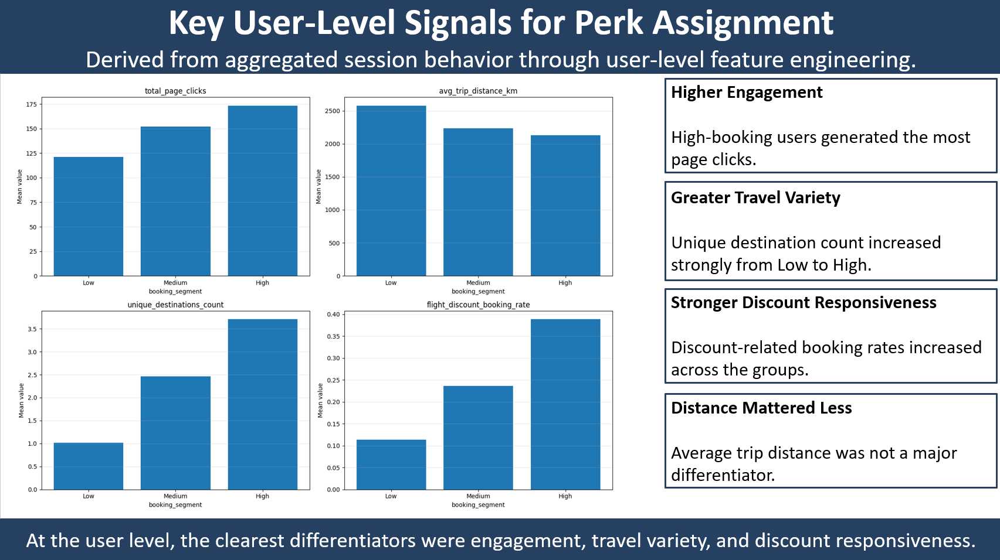
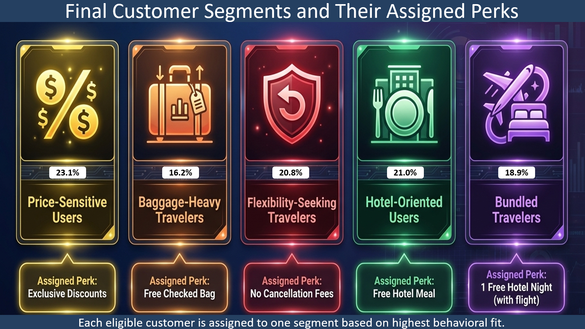
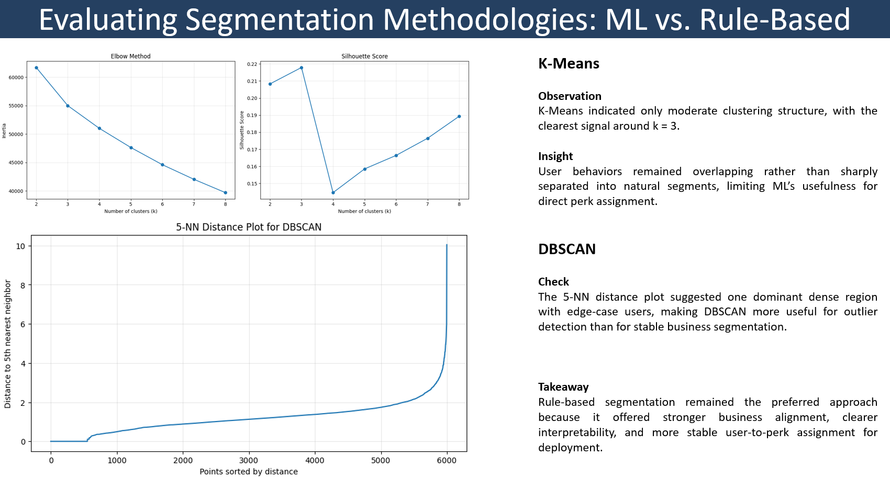

# TravelTide — Customer Segmentation & Retention (Case Study)

## Project overview
This case study explores how TravelTide can improve customer retention through a more personalized rewards strategy.

The business challenge was to move away from generic offers and design a framework that assigns each eligible customer to the reward perk most aligned with their historical behavior.

The final outcome of the project is a **rule-based behavioral targeting framework** that maps users to one of five actionable perk categories, supported by exploratory machine learning analysis for comparison.

---

## Business objective
TravelTide wants to improve retention by offering more relevant rewards to existing customers.

Instead of relying on broad demographic personas, this project focuses on **behavior-based segmentation** and aims to answer one key question:

**Which available perk is most relevant for each customer based on their past travel behavior?**

---

## Project workflow
The project followed this analytical pipeline:

1. Join raw session, user, flight, and hotel data  
2. Filter the active customer cohort  
3. Validate and clean key booking-related fields  
4. Aggregate session behavior into user-level features  
5. Build perk-specific rule-based scoring logic  
6. Compare the rule-based framework against ML-based clustering approaches  
7. Generate final customer segments and business recommendations  



---

## Methods used

### 1. Rule-based segmentation
The final segmentation framework was built around the five perks TravelTide can actually offer:

- Exclusive Discounts
- Free Checked Bag
- No Cancellation Fees
- Free Hotel Meal
- 1 Free Hotel Night with Flight

For each perk, a small set of relevant behavioral features was selected.  
These features were converted into percentile ranks and combined into **perk-fit scores**.  
Each user was then assigned to the perk with the highest score.

### 2. ML-based exploration
Unsupervised learning methods were also tested for comparison:

- **K-Means**
- **DBSCAN**

These methods were useful for exploratory pattern discovery, but they did not provide the same level of business alignment, interpretability, or stability as the rule-based framework.

---

## Key findings

### Session-level findings
- Hotel discounts were associated with stronger conversion than flight discounts
- Page-click activity was a strong signal of booking intent
- Cancellations appeared only in bundled flight + hotel bookings
- Converted sessions often included both flight and hotel activity

### User-level findings
The clearest user-level differentiators were:

- **Engagement**
- **Travel variety**
- **Discount responsiveness**

Average trip distance was less useful as a segmentation driver.



---

## Final customer segments
The final rule-based framework assigns each eligible user to one of five mutually exclusive segments:

- **Price-Sensitive Users** → Exclusive Discounts
- **Baggage-Heavy Travelers** → Free Checked Bag
- **Flexibility-Seeking Travelers** → No Cancellation Fees
- **Hotel-Oriented Users** → Free Hotel Meal
- **Bundled Travelers** → 1 Free Hotel Night with Flight

Segment sizes were relatively balanced, which supports practical deployment in a marketing campaign.



---

## Why rule-based outperformed ML for this use case
Although machine learning helped explore the structure of the user base, the final recommendation favored the rule-based framework because it offered:

- stronger business alignment
- clearer interpretability
- more stable user-to-perk assignment
- direct readiness for campaign deployment

In this case, the most effective segmentation approach was not the most complex one, but the one most clearly connected to business action.



---

## Repository structure

```text
traveltide-segmentation-retention/
│
├── data/
│   ├── processed/
│   │   ├── sessions_filtered_cleaned.csv
│   │   └── user_agg_features.csv
│   └── outputs/
│       ├── user_perk_assignment.csv
│       ├── segment_summary.csv
│       └── segment_profile_summary.csv
│
├── docs/
│   ├── notes.md
│   └── traveltide_precision_targeting_presentation.pdf
│
├── images/
│   ├── workflow_overview.png
│   ├── user_level_signals.png
│   ├── final_segments_and_perks.png
│   └── methodology_comparison.png
│
├── notebooks/
│   └── traveltide_precision_targeting.ipynb
│
├── sql/
│   ├── 01_create_sessions_joined.sql
│   ├── 02_create_sessions_filtered.sql
│   └── 03_create_user_agg_features.sql
│
├── README.md
├── requirements.txt
└── .gitignore
```

---

## Data files

### `data/processed/`
- **sessions_filtered_cleaned.csv** — cleaned and filtered session-level dataset used for downstream aggregation
- **user_agg_features.csv** — aggregated user-level behavioral feature table

### `data/outputs/`
- **user_perk_assignment.csv** — final rule-based perk assignment for each eligible user
- **segment_summary.csv** — size and share of each final segment
- **segment_profile_summary.csv** — average feature profile of each segment

---

## SQL and notebook usage
The project uses a mixed workflow:

- **SQL / Spark SQL** was used for data joining, cohort filtering, and user-level feature aggregation
- **Python / pandas** was used for data cleaning adjustments, rule-based scoring, segmentation logic, ML comparison, and final exports

The SQL files in this repository follow the **Spark SQL / Databricks SQL** dialect.

---

## Data source note
Initial data retrieval was performed in the Databricks course environment using the TravelTide case-study database.  
Processed datasets and final project outputs are included in this repository for review.

---

## Tools
- Python 3.12
- pandas
- NumPy
- Spark SQL / Databricks SQL
- Matplotlib
- scikit-learn

---

## Final recommendation
The recommended next step for TravelTide is to deploy the five rule-based segments as the primary targeting framework for a personalized rewards campaign.

Performance should be validated through A/B testing using:

- email open rate
- perk sign-up rate
- incremental ROI versus a non-segmented control group

---

## Presentation
The final project presentation is included in the `docs/` folder as a PDF.

---

## Author
Portfolio project developed as part of a customer segmentation and retention case study focused on behavioral analytics, perk assignment, and business-oriented segmentation design.